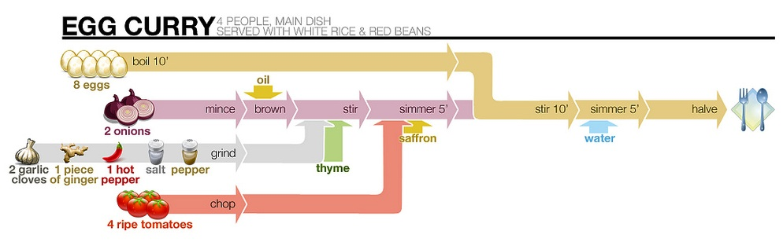
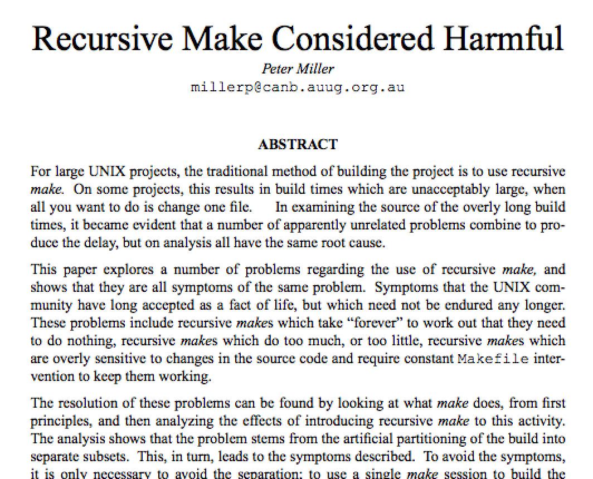

# make and redo for automation

by Scott Vokes ([@silentbicycle][sb])

[sb]: https://github.com/silentbicycle/

# **What is make?**

<!-- I'm going to talk about how to use make effectively, then I'm going
to introduce redo, a program that tries to improve on make's design
while keeping the good aspects. Even if you can't use redo, learning how
to use it will also help bring good make techniques into focus. -->

# Not just build systems

<!-- While make and redo are typically described as build systems, their idea
of "building" is far more general than many realize. 

Makefiles describe a set of targets, some of which may produce input for
other targets, and execute them in a dependency-based order. -->

# make(1) -- 1976

<!-- make is a fairly old tool, dating back to the early days of Unix.

Have any of you ever had mysterious things happen because something was
partially regenerated, but some stale cached parts caused results that
didn't line up with the current state of things? Crashes? Linking
errors? Broken links? make was originally written to automate away that
kind of problem. -->

# Focus on Dependencies

<!-- Unlike programming languages that are based around steps to
execute, messages to pass between objects, or whatever, make puts
the primary focus on dependencies. -->

#

Credit: ["How recipes should look"](https://www.flickr.com/photos/starsammy/4605760111)
by starsammy, Flickr; cropped.

<!--
https://www.flickr.com/photos/starsammy/4605760111
License: https://creativecommons.org/licenses/by/2.0/
NOTE: Cropped to only the first recipe.
-->

<!-- See this recipe diagram? By focusing on dependencies between the
different ingredients, it makes it visually clearer that a couple things
can be done in parallel: while boiling the eggs, you could also mince
and brown the onions, chop the tomatoes, and so on. A couple sous-chefs
would be able to work on those steps at the same time without getting in
each others' way. -->

# Goal-Directed Programming

<!-- Ultimately, make is a tool for goal-directed programming. Rather
than telling it a full series of operations, you describe how to perform
individual tasks (by shell commands), what depends on what, and let it
figure out the best order to execute them on demand. -->

# Unix-Flavored Prolog?

<!-- It a way, it's like a Unix-flavored Prolog - you try to specify
your problem domain, but leave most of the overall control flow to its
built-in dependency search.

And just like Prolog, if you try to write Makefiles like a typical
scripting language, you will likely end up with an awkward result. -->

# Idempotency

<!-- Like configuration management tools, Make expects the targets
to be idempotent -- if its output already exists and is up to date,
skipping rebuilding it should lead to a functionally identical
result.

That way, if only a small portion of the tasks need to be run, then
running the main target can be completed much sooner. This can save a
lot of time working iteratively.

Unlike ansible (for example), which will potentially run through a whole
playbook of tasks, noting individually that they are complete, make is
operating on a tree of dependencies, and if a target is up to date, it
assumes all tasks contained within it can be skipped. -->

# **Using make**

# make [target]

<!-- To run a target in a make file, use `make target`.
If the target is omitted, the first rule will run. -->

# Rule format

    target: list of deps
    <TAB>program -o target --flag list of deps

<!-- A rule consists of a target name, a list of dependencies for it,
and instructions for how to build the target.

Yes, the literal tab is required. More on that later. -->

#

Credit: ["Slide Rule"](https://www.flickr.com/photos/instantvantage/5780391408)
by instantvantage, Flickr

<!--
Atribution:
    https://www.flickr.com/photos/instantvantage/5780391408
    https://creativecommons.org/licenses/by-sa/2.0/ (CC BY-SA 2.0)
-->

<!-- Since make is about dependencies, makefiles are mostly rules:

. X should be updated if Y changes
. to make an .html file from a .md file, run "markdown" on the .md file
-->

# Pattern rules

    %.png: %.dot
	        dot -Tpng -o $@ $<

<!-- NOTE: This syntax is GNU make only.
BSD make would instead look like:

.SUFFIXES: .dot .png
.dot.png:
	dot -Tpng -o $@ $<
-->

<!-- There are a couple forms for abstracting over individual filenames.
GNU-make-style pattern rules are preferred, because they can also
list other dependencies. -->

# Variables

    ${PROJECT}: ${OBJS}
            ${CC} -o $@ ${LDFLAGS} $^
            

<!-- Also, variables can be passed on the command line, expanded from
the shell environment, or defined in the makefile itself.

It's expected that they won't change between cached runs, though. -->

# \$@ \$< \$? \$^ \$+ \$*

    $@ target
    $< first prereq
    $? all NEWER prereqs
    $^ all prereqs, ONCE (GNU only)
    $+ all prereqs, with DUPLICATES
    $* stem (file w/out ext.) in % rules

<!-- There are also several built-in variables, with names that seem
pretty arbitrary. -->

# Good tutorial: 'PMake'

<!-- My favorite in-depth tutorial for make is the 'PMake' one (linked
below). PMake became BSD make; it was originally named "PMake" because
its novel feature was parallelism, building with multiple processes.

While GNU make is more common, I find BSD make to have a better defined
set of features, and this tutorial covers those well. "make: The Good
Parts", if you will. Once you learn to use BSD make effectively, using
GNU make isn't much different; GNU make has a lot of extra features,
but many are probably better handled by other tools.

I mean, GNU make even has *eval*. -->

# **Automation**

<!-- I've tended to lean a lot on make for automation. Not just in a
programming context, where I can use it for rebuilding, running tests,
or generating benchmark data. I've also used it for generating static
web pages off of plaintext markup, generating diagrams for presentations
from graphviz dot code, and just saving keystrokes. -->

# Resumable sequences of commands

<!-- If you are running a series of commands to produce some kind of
output file, you might benefit from using make. If it generates several
files along the way, you might be able to resume from a step partway
along and iterate faster than starting from scratch every time. -->

# Filesystem as database

<!-- make keeps its state in the database. Even if what you're doing doesn't
normally produce incremental files along the way, You can create temporary
dotfiles to mark progress. -->

<!-- This presentation is generated from markdown text for slides, using
make to drive pandoc creating reveal.js presentations out of markdown
slides. Granted, pandoc is doing the majority of the work, but being
able to just type "make" and have it complete in a few msec if there
isn't any new work to do is a nice workflow. -->

# **Advantages**

# make is (almost) everywhere!

<!-- make is likely to be installed on almost every Un*x system.
If you prefer to use something else, you can still use it
to bootstrap your preferred toolchain.

In the absolute worst case, you can still install something minimal like
[ake](https://github.com/darius/ake), a mini-make implemented in awk,
which is required to be available. -->

# Fairly concise

    out: deps
        gen out deps

<!-- While generated Makefiles can be quite verbose or complex, ones
used for automation don't need to be. -->

# Low startup costs

<!-- Unlike rake and similar systems for other languages/platforms, make
is pretty lightweight. Automation via a Makefile should add very little
startup overhead (perhaps a few milliseconds) compared to running the
commands directly. (This is less true for compiling large projects with
complex dependency trees, but we're mainly talking about automation
here.)

Because rake has to load Ruby and related infrastructure, it can still
take 300 msec or so to run a no-op rake task. That may not seem like
much time, but it can be enough to make integration with editors feel
awkward, and can be mentally jarring in the heart of a develop/test
workflow. make is typically running in under 10 msec, giving much less
mental friction. -->

# Task parallelism

<!-- As long as you've accurately expressed dependencies, make can
schedule tasks that aren't going to directly impact each other in
parallel, making better use of multiple processor cores.

Like xargs(1), this is often an easy way to add parallelism for
command-line stuff. -->

# make -j8

# Not language / platform specific

ant, maven, lein, cabal, ...

<!-- Most of the make spin-offs I've seen have been more focused on a
particular platform or language. While this means they're usually better
at things like detecting dependencies, it also means they're less
effective for automating general tasks. -->

# **Disadvantages**

<!-- All that said, there are some flaws in make that aren't likely to
change any time soon. Many of them are details of the popular
implementations, rather than issues in the core model, and lead to
less trouble if they're known in advance. -->

# The Closed-World Assumption

# 

<!--
 https://creativecommons.org/licenses/by-nc-nd/2.0/
 https://www.flickr.com/photos/sesen/374945022
 -->

Credit:
["Hammy in the Ball"](https://www.flickr.com/photos/sesen/374945022) by
Meg Lauber (@sesen), Flickr

<!-- The most significant disadvantage with make is that it needs
the dependency information you give it to be accurate. If it has
gaps in its knowledge, those gaps may distort execution by failing
to update something after its input has changed, allowing two
concurrent processes to update a target at the same time, or
otherwise leading to inconsistent state.

Often, this is from not indicating that a file depends on the Makefile
itself (which may have some platform-specific configuration), leading to
stale configuration data causing other problems. -->

# Nesting is awkward

#

<!-- ...and if you try to drive everything from a single top-level
make file, it often leads to cumbersome, deeply nested paths.

Again, this is less an issue with automation than while building
software projects, but it is probably make's most significant
weakness. -->

<!-- This gets worse when sub-instances of make are being run nested
during the make execution, because the nested make processes will
probably only communicate with the parent make by whether a target
file exists or not. -->

# Historical baggage

"...a few weeks later I had a user population of about a dozen..."

<!-- The tab literal required in Makefiles could have been relaxed to
*any* leading whitespace (or whatever), but by the time the problems
with that design were understood, it would have been a major interface
change.

"Why the tab in column 1? Yacc was new, Lex was brand new. I hadn't
tried either, so I figured this would be a good excuse to learn. After
getting myself snarled up with my first stab at Lex, I just did
something simple with the pattern newline-tab. It worked, it stayed. And
then a few weeks later I had a user population of about a dozen, most of
them friends, and I didn't want to screw up my embedded base. The rest,
sadly, is history." - Stuart Feldman, author of make
   (quote from http://www.catb.org/esr/writings/taoup/html/ch15s04.html)
-->

# Implicit behavor

<!-- Make has a lot of built-in rules. (You can typically print them
somehow; for GNU make, use `make -p`.) The installated version on this
computer includes rules for not just C and C++, but also TeX / LaTeX,
RCS, and some other things. Rather than having a clean slate and an
explicit import of some sort (e.g., "load common rules for C"), it
assumes familiarity with lots of implicit variables like ${LDFLAGS}.

Having something almost-work because of built-in rules used instead of
rules I've explicitly provided has led to some particularly confusing
issues. -->

# Poor culture of re-use

    include (GNU)
    #include (BSD)

<!-- Also, make has just enough built-in behavior to take the pressure
off support for packaging & sharing target rules for common tasks.
Instead of working off a shared base, a lot of projects' makefiles seem
to end up with some copy-paste-modify incantations and generated code
that isn't relevant. This gives make a confusing reputation.

(The best counterexample to this is the make infrastructure included
with OpenBSD. It's the exception that proves the rule, though.) -->

# The Autotools

*we have a sad feeling for a moment, and then it passes*

<!-- Instead of a good package system for make, we got The Autotools. -->

# **\~**

# **redo**

<!-- There's been several make-inspired tools since the 70s. One I've
seen that seems to improve most of make's gotchas (while keeping its
good aspects) is redo. -->

# djb

"Rebuilding target files when source files have changed"

<!-- Daniel J. Bernstein, author of qmail and daemontools (among other
things) posted some fairly brief notes on his site, gathered under the
heading "Rebuilding target files when source files have changed". These
described some common problems with make, and design changes that
would remedy them. -->

# Top-down, like make

<!-- Fundamentally, redo has the same model as make -- you specify
targets, what they depend on, and how to rebuild them once their
dependencies are up to date. -->

# Atomic targets

<!-- One crucial change in redo is that targets are atomic. Instead of
replacing targets while building, targets are built to temp files, and
moved over once complete. This means that if the build is interrupted
(crashing, power outage, etc.) there won't be a file with a newer
timestamp and corrupt contents to mess up everything that depends on it.
-->

# A database

<!-- Also, redo keeps a database across runs, tracking more info than
just files and their timestamps. This means that redo can use a
generated thing to tell what it depends on, and then add those
dependencies to the database to inform future runs. It's easier to get
accurate dependency information this way, and keep it up to date. -->

# default.do, default.o.do, ...

<!-- Another major stylistic difference is that, instead of having one
large Makefile at the root of a directory tree, there are multiple .do
files throughout. These scripts are scoped to their own directory,
so referring to targets in sub-sub-directories doesn't lead to long
relative paths - things compose more cleanly. Also, targets depend on
the .do file that built them; changing configuration options in a .do
file impacts that part of the tree, not everything using a single
Makefile.

redo treats "recursive make" as the common case and makes it work
better. -->

# No built-in rules

<!-- There are no file-specific built-in rules in redo, so it's
clearer where behavior is coming from. -->

# **Essential redo**

<!-- Instead of using their own shell-script-like language, these .do
scripts are just normal shell scripts. The trick is that they can call
into `redo-ifchange`, to inform the running `redo` process about
dependency information.

When a dependency is mentioned, it's recorded. This dependency
information can be derived from the recently built target, which often
makes it simpler to get very accurate dependency info. On future runs,
this information is used to schedule worker processes.

Similarly, `redo-ifcreate` is based on whether a file exists, not if it
has changed. Other hooks such as `redo-hash` (comparing content) could
use the same underlying mechanism.

(Because of how redo-ifchange works, the .do scripts could also be
written in any #!-able language.) -->

# redo [target]

<!-- So, to use redo, `redo` is called, with an optional target. If no
target is given, redo defaults to `all`. -->

# .do files

+ TARGET.do
+ default.EXT.do
+ default.do

<!-- It looks for a .do file for the target (e.g. `all.do`). If that is
found, it's executed, otherwise it falls back on `default.do`. For
targets with an extension, like `foo.o`, it will try `foo.do`, then
`default.o.do` (common behavior for an extension), then `default.do`.
-->

# $1 target $2 target, no ext. $3 tmp file

<!-- These scripts are always called with three arguments.
they are seemingly just as arbitrary as $@ $^ etc. in make, but
those three are all that are needed.

default.do can use a switch-case statement on $1
to handle several targets in the same .do file, if desired. -->

# 

# ./compile $2.c $3

<!-- a typical .do file for c object files would look like this:

    redo-ifchange compile $2
    ./compile $2.c $3
    
djb suggests having `compile` itself be a script generated by redo,
which contains all the compilation options -- it just takes a source
file and an output name. (This same pattern also works nicely with
make.) That way, all platform-specific config is handled in one spot,
and will be invalidated / rebuilt if the options are changed. -->

# Or, save stdout

<!-- Instead of using $3 for the temp output file, redo will also save
any content sent to stdout. (I'm not entirely convinced that this is
a good default, but it hasn't been a problem yet.) -->

# redo-ifchange list of deps

<!-- The other benefit with redo-ifchange is that all the targets
depended on by the same redo-ifchange can be scheduled to be rebuilt
in parallel. -->

# Where do I get it?

[https://github.com/apenwarr/redo][1]

[1]: https://github.com/apenwarr/redo

<!-- Unlike make, which is distributed with Un*x, you need to download
redo. djb hasn't released his implementation, but Avery Pennarun has a
Python [implementation][redo] based on djb's design released under the
GPL license. His redo repo also includes a public-domain implementation
as a 175-ish line shell script, the redo counterpart to Darius Bacon's
ake script. It doesn't support incremental rebuilding, but is otherwise
compatible with full redo. -->

# **Disadvantages**

# Relatively unknown

<!-- Relatively few people have redo installed, and it's just one more
hoop for users to jump through to work on their actual goals. As it only
depends on Python, a reasonably POSIX-y environment, and SQLite, it's
not too hard to install, but can't be assumed present like make. -->

# Python implementation

<!-- Python doesn't start up as quickly as if it were implemented in C,
Go, OCaml, or whatever. Not a huge problem, but it can add up when
iterating on a problem. -->

# Little files throughout filesystem

<!-- It can leads to several .do files scattered throughout, and they
won't necessarily collate together. -->

# All the portability of shell scripts

<!-- There are lots of little variations between shells, and it's easy
for someone to unknowingly depend on a bash-ism. It's a good idea to
check redo files that will be distributed on a couple different
platforms, trying shells such as busybox's sh, and not just bash. -->

# **make vs. redo**

<!-- Still, most of these differences are refinements of make's core
design, rather than a fundamentally different system. I've found that
learning redo has given me a better understanding of how to avoid common
mistakes in make, along with a couple useful idioms. -->

# ./compile $2.c $3

<!-- For example, makefiles usually have a bunch of platform-specific
options, which need to impact the shell commands that do the actual
work. Sometimes changing one option should invalidate everything,
sometimes it only impacts a small subset. Makefile's dependency tracking
usually breaks down when it comes to that kind of thing.

I saw djb suggest using a script called "compile" (or whatever) to do the
actual compilation, with the settings included, and then regenerate that
"compile" script as the settings change. A very clean solution. -->

# **Closing**

# Not just build tools

<!-- redo improves on several aspects of make, but both are very useful
tools. I prefer redo as a build system for programming projects
(particularly as projects become nested), but most of the reasons why
matter far less when using make for other workflow automation, and it's
available almost everywhere. -->

# Building these slides (make)

    $ cat Makefile
    TEMPLATE= template.revealjs

    PANDOC= pandoc --section-divs -t html5 \
        -s --template ${TEMPLATE}

    slides.html: slides.md ${TEMPLATE} Makefile
	        ${PANDOC} -o $@ slides.md

# Building these slides (redo)

    $ cat all.do
    redo-ifchange slides.html

    $ cat default.html.do
    redo-ifchange slides.md
    TEMPLATE="template.revealjs"
    PANDOC="pandoc --section-divs -t html5 \
        -s --template ${TEMPLATE}"
    ${PANDOC} -o $3 $2.md

# Resources

+ ["Make - A Program for Maintaining Computer Programs"](http://sai.syr.edu/~chapin/cis657/make.pdf)
<!-- The original make(1) paper -->

+ ["Rebuilding target files when source files have changed"](http://cr.yp.to/redo.html)
<!-- The original redo design notes -->

+ [PMake](https://www.freebsd.org/doc/en_US.ISO8859-1/books/pmake/) - excellent make tutorial (uses BSD make)

+ [mk](http://plan9.bell-labs.com/sys/doc/mk.html) - recommended practices
<!-- Notes on plan9's mk, which is very similar to make, and has much
commentary on good practices to follow when using make-like tools. -->

+ ["Purely Top-Down Software Rebuilding"](http://grosskurth.ca/papers/mmath-thesis.pdf)
<!-- A master's thesis on make and redo. -->

+ apenwarr's [redo](https://github.com/apenwarr/redo) implementation

+ _Time Management for System Administrators_
<!-- A book which has a section on using make specifically for automation. -->

+ ["A quick introduction to redo"](http://pozorvlak.livejournal.com/159621.html)
<!-- A great redo tutorial. -->

# Thank You!
